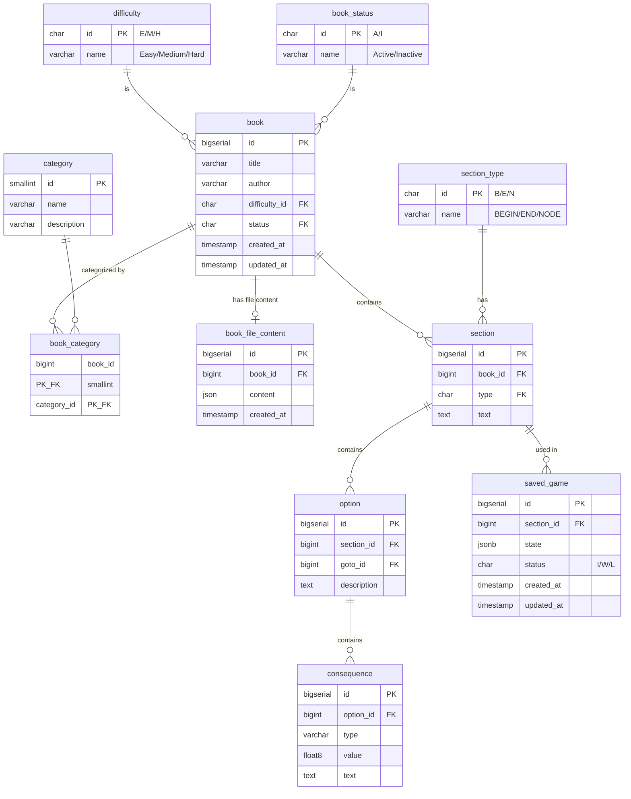

# Adventure Book

Interactive adventure book platform with JSON-based book import, session management, and dual storage architecture.

## Overview

Adventure Book is a multi-module Spring Boot application that enables users to read and play through interactive adventure books.
The system supports:
 - Importing books from JSON files.
 - Searcing for books by title, author, difficulty, and category.
 - Editing book categories.
 - Managing game sessions with temporary and persistent storage,
 - Navigating through sections by choosing options, and applies consequences based on player choices.

## Modules

### Common
Shared utilities and domain abstractions used across all modules.

- **Result Pattern**: Type-safe error handling with `Result<T>`, `Success<T>`, and `Failure` types.
- **Error Handling**: Standardized error codes and types (`ErrorCode`, `ErrorType`, `AppError`).
- **Domain Types**: Base value objects (`Value`, `ComparableValue`) for domain-driven design.

### Books
Multi-module service for managing adventure books and their metadata.

- **books-domain**: Domain models (Book, Category, Difficulty, Author, Title, and BookStatus).
- **books-persistence-api**: Repository interfaces for data access abstraction.
- **books-persistence**: PostgreSQL implementation with Spring Data JDBC, full-text search, and Flyway migrations.
- **books-svc-api**: Service interface for book operations.
- **books-svc**: Business logic implementation.
- **books-web**: REST API with OpenAPI specification, Swagger UI, and controllers for books details, searching and admin operations.

#### API Endpoints
- `POST /api/v1/books` - Create a new book
- `GET /api/v1/books` - Search books by title, author, difficulty, and category, with pagination.
- `GET /api/v1/books/{bookId}` - Retrieve a specific book by ID
- `GET /api/v1/books/{bookId}/categories` - Get categories for a book by ID
- `POST /api/v1/books/{bookId}/categories` - Add categories to a book by ID
- `DELETE /api/v1/books/{bookId}/categories/{categoryId}` - Delete a category from a book by ID

Swagger UI is available at: http://localhost:8080/swagger-ui/index.html

### Game
Multi-module service for managing game sessions, reading books, and handling player progression.

- **game-domain**: Domain models (Session, Section, Option, Consequence, SessionState, SectionType, and GameStatus).
- **game-persistence-api**: Repository interfaces for session and saved game storage.
- **game-persistence**: Dual storage implementation:
  - **Redis**: Temporary session storage with 24-hour TTL for active gameplay.
  - **PostgreSQL**: Persistent saved game storage with Spring Data JDBC and Flyway migrations.
- **game-svc**: Business logic for game flow, section navigation, and consequence handling.
- **game-web**: REST API with OpenAPI specification for starting games, choosing options, and saving progress.

#### Features
- **Start Game**: Start reading a book from its BEGIN section.
- **Navigate Sections**: Choose options to jump between sections.
- **Consequence System**: Automatic application of consequences (LOSE_HEALTH, GAIN_HEALTH) based on player choices.
- **Dual Storage**: Active sessions stored in Redis for performance, with manual save to PostgreSQL for persistence.
- **Health Tracking**: Player health is tracked and updated throughout gameplay.

#### API Endpoints
- `POST /api/v1/game/start` - Start a new game session.
- `POST /api/v1/game/{sessionId}/choose` - Choose an option and move to the next section.
- `POST /api/v1/game/{sessionId}/save` - Save the current game session to persistent storage.

Swagger UI is available at: http://localhost:8081/swagger-ui/index.html

#### Storage Architecture
- **Redis** (localhost:6379): Stores temporary sessions during active gameplay with 24-hour expiration.
- **PostgreSQL** (localhost:5432): Stores permanently saved games via the `/save` endpoint.

### File Importer
Batch processing module for importing adventure books from JSON files into the database.

- **Spring Batch Integration**: Multi-step job for book import with validation, insertion, and activation phases.
- **JSON Import**: Reads book definitions from JSON files in the `books-examples/` directory.
- **Validation**: Validates book structure, sections, options, and consequences before import.
- **Batch Steps**:
  1. **Validation**: Verifies JSON structure and data integrity.
  2. **Book Insertion**: Creates book record in the database (with INACTIVE status).
  3. **Section Insertion**: Imports all sections with their metadata.
  4. **Options Insertion**: Imports choices and consequences.
  5. **Book Activation**: Marks books as available for gameplay (ACTIVE status).

#### Example Books
- `books-examples/crystal-caverns.json`
- `books-examples/pirates-jade-sea.json`
- `books-examples/the-prisoner.json`

## Infrastructure

### Docker Compose
The project includes a `compose.yaml` file for running required infrastructure:
- **PostgreSQL**: Database for books and saved games
- **Redis**: Cache for active game sessions

Run with: `docker compose up`

### Database Schema

## Getting Started

1. Maven compile: `mvn install`
2. Start infrastructure: `docker compose up`
3. Import example books using the file-importer batch job
4. Start the Books service (port 8080): http://localhost:8080/swagger-ui/index.html
5. Start the Game service (port 8081): http://localhost:8081/swagger-ui/index.html
6. Begin playing an adventure book via the Game API

## Future Features, Enhancements, and Optimizations

Features that could be added:
- **Load game**: Implement a mechanism to load player progression from a previous saved game.
- **History and undo action**: Implement a history service to track player progression and track changes to books and sections.
  - Each action a user makes would throw an event into the history stream.
    The history service would be responsible for aggregating and saving player progression over time.
    Possibly, this could be integrated with the Game service to provide an undo action for the player.
- **Batch Processing**:
  - **Error Handling**: Create a table `book_import_errors` to store errors that occur during book import. This would allow us to track and fix errors in the book import process.
  - **Mapping Sections to files**: In the book import batch, we could have a new table `book_file_sections_map` that would map section IDs from `section` table to the corresponding section id in the json file.
    This would allow us to have a better error handling and logging during the book import process, as we would be able to log the section id from the json file that caused the error, instead of just the section id from the database.
- **Validate duplicate books**: Add a `file_hash` column to the `book_file_content` table, and before importing a book, calculate the hash of the file and check if it already exists in the database. If it does, we can skip the import and log a warning. This would prevent duplicate books from being imported into the system.

System Enhancements:
- **Security**: Implement authentication and authorization using Spring Security, with role-based access control for admin operations (e.g., book management) and user-specific game sessions.
- JWT tokens for stateless authentication
- Role-based access control for API endpoints
- **Logging**: Implement structured logging with correlation IDs to trace user sessions and book interactions across services.
- **Metrics**: Integrate Prometheus and Grafana for monitoring application performance, tracking API usage, and identifying bottlenecks in the system.
- **Acceptance tests**: Write automated tests to ensure the system behaves as expected and meets business requirements.

Optimizations:
- **Batch Processing**: Batch processing of book imports should run outside of ApplicationContext. It could run using an AWS Lambda function.
- **Caching**: Implement caching for frequently accessed book data to reduce database load and improve response times.
- **Elasctic Search**: When Postgres full text search can't handle the load anymore, integrate Elasticsearch for advanced search capabilities and faster retrieval of books based on categories, difficulty, and full-text search. 100% match on title and author.
- **Split into multiple microservices**: As the application grows, consider splitting the Books and Game modules into separate microservices to improve scalability and maintainability. This would allow each service to be developed, deployed, and scaled independently based on its specific needs. See the following design: 

